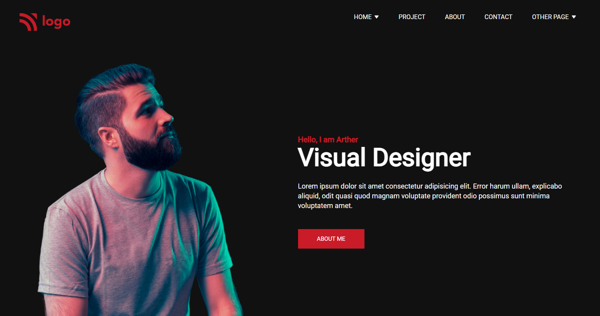

# [Product Design Landing Page](https://product-design-landing-page-15th.netlify.app/)

## About Project

This is a landing page or protfolio page of a imaginary designer called Arther. This page displays services provided by him, his experience, and his projects on which he worked on.

## Time Taken

It took me around 5-6 hours for this project.

## Concepts used

 - Used flex property to align the divs and the nav elements.
 - Used grid display property for the cards.
 - basic margin & padding.
 - changed the color of the logo using filter property.

> This Web Page is not responsive for now.

## Find me on -
  
  - [LinkedIn](https://www.linkedin.com/in/varun-g-65282489)
  - [Github](https://github.com/varung735)
